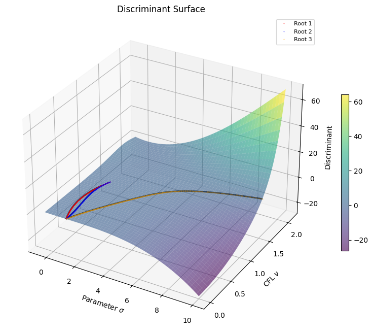
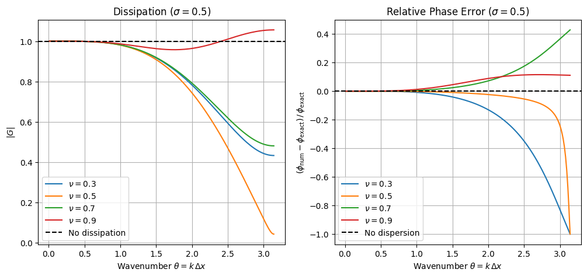
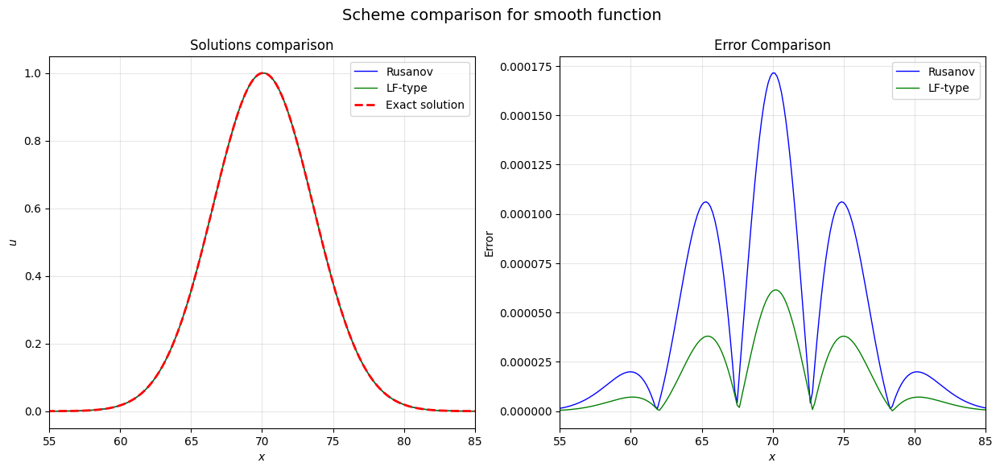
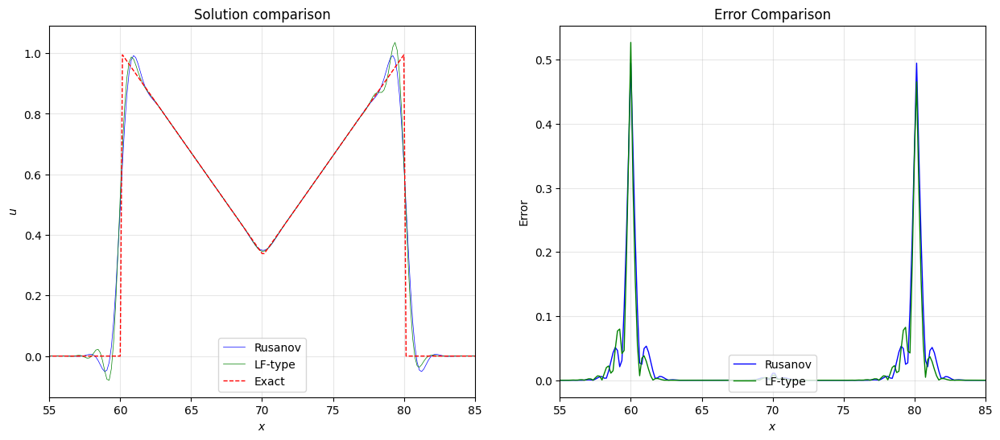
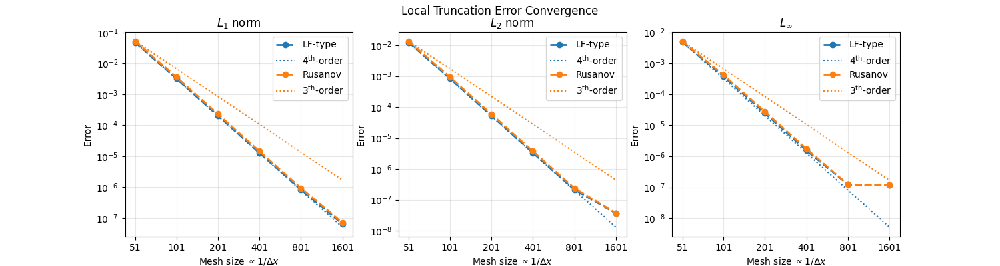
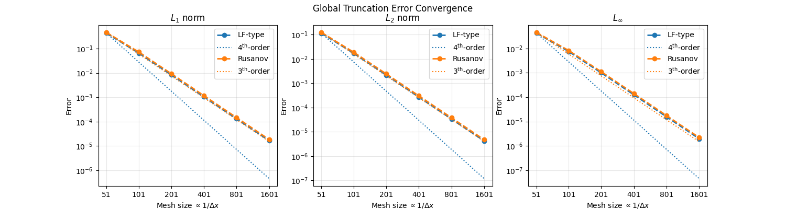
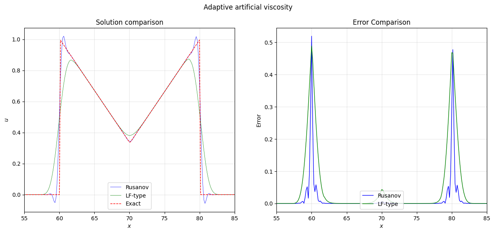

Помоги мне пос

1. Сделать план презентации более полным.
    - 

2. Дополнить опущенную теорию.
2. Проверить результат на ошибки (орфографические, граматические и фактические). МОжешь исправлять найденные ошибки.

3. Переписать Оформить презентацию с помощью `beamer`. Образец будет приведен позже.
3. Сопроводить презентацию сценарием для говорящего.

Сначала начнем с (1) преобразования исходников. Этот план разделен на секции

Самый низкие подсекции предпалагаются отдельным слайдами в будущем (но могут быть разделены на отдельные)

---

## Постановка задачи

На прямоугольной области рассматриваем уравнение переноса:
$$
\frac{\partial u}{\partial t} + \operatorname{div}(\vec{a}\,u) = 0,
$$
где $\vec{a}$ --- вектор скорости.

При $a = \mathrm{const} > 0$ уравнение принимает вид:
$$
\frac{\partial u}{\partial t} + a\,\frac{\partial u}{\partial x} = 0.
$$

## Построение сетки

потоки, ячейки

## Построение метода

### Изначальный метод

#### Метод Лакса-Фридрихса

$$
\begin{table}[h]
\centering
\begin{tabular}{@{}lccc@{}}
\toprule
Метод & Порядок & Диффузия & Осцилляции \\
\midrule
Против потока        & 1-й  & Высокая      & Нет         \\
Лакса-Фридрихса      & 1-й  & Высокая      & Нет         \\
Лакса-Вендроффа      & 2-й  & Низкая       & Да          \\
Ограничитель         & 2-й  & Низкая       & Нет         \\
\bottomrule
\end{tabular}
\end{table}
$$

$$
\begin{table}[h]
\centering
\begin{tabular}{@{}>{\raggedright}p{0.3\linewidth}l@{}}
Классическая схема Лакса-Фридрихса: & $ u_i^{n+1} = \frac{1}{2}(u_{i+1}^n + u_{i-1}^n) - \frac{a\Delta t}{2\Delta x}(u_{i+1}^n - u_{i-1}^n).$ \\[2em]
Консервативная форма: & $ u_i^{n+1} = \frac{1}{2}(u_{i+1}^n + u_{i-1}^n) - \frac{a\Delta t}{\Delta x}(W^n_{i+1/2} - W^n_{i-1/2}).$ \\
\end{tabular}
\end{table}
$$

#### Модификация метода Лакса-Фридрихса

Введём параметр $\sigma \in [0,\,1]$:
$$
u_i^{n+1} = \left[\sigma\, u_i^n
+ (1-\sigma)\,\frac{u_{i + 1}^n + u_{i - 1}^n}{2}\right]
- \frac{a\Delta t}{\Delta x}\bigl(W^n_{i+1/2} - W^n_{i-1/2}\bigr).
$$

В развёрнутом виде:
$$
u_i^{n+1} = \left[\sigma\, u_i^n
+ (1{-}\sigma)\,\frac{u_{i + 1}^n + u_{i - 1}^n}{2}\right]
- a\Delta t\,\frac{u_{i + 1}^n - u_{i - 1}^n}{2\Delta x}
+ \frac{a^2\Delta t^2}{2}\,
    \frac{u_{i + 1}^n - 2u_i^n + u_{i - 1}^n}{\Delta x^2}.
$$

Замечание: при $\sigma = 1$ схема вырождается в схему Лакса-Вендроффа.

#### Корретировка

#### Анализ ошибки метода

При помощи разложения значений в узлах по формуле Тейлора можно получить дифференциальное приближение. Тогда:
$$
\begin{aligned}
u_i^{n+1}
&= u_i^n - a\Delta t\,(u_x')_i^n
+ \frac{a^2\Delta t^2}{2}(u_{xx}'')_i^n
+ \boxed{(1{-}\sigma)\frac{\Delta x^2}{2}(u_{xx}'')_i^n}
- \boxed{a\Delta t\,\frac{\Delta x^2}{6}(u_{xxx}''')_i^n} \\[0.4em]
&\quad
+ \frac{a^2\Delta t^2}{2}\,\frac{\Delta x^2}{12}(u_{xxxx}^{IV})_i^n
+ \boxed{(1{-}\sigma)\frac{\Delta x^4}{24}(u_{xxxx}^{IV})_i^n}
- a\Delta t\,\frac{\Delta x^4}{120}(u_{x^5}^{V})_i^n \\[0.4em]
&\quad
+ \frac{a^2\Delta t^2}{2}\,\frac{\Delta x^4}{360}(u_{x^6}^{VI})_i^n
- \frac{a^3\Delta t^3}{6}(u_{xxx}''')_i^n + \dots
\end{aligned}
$$

#### Корректировка ошибки

Старший член ошибки аппроксимируем на 5-точечном шаблоне:
$$
\left(\frac{\partial^3 u}{\partial x^3}\right)_i
\approx A\,u_{i - 2} + B\,u_{i - 1} + C\,u_i + D\,u_{i + 1} + E\,u_{i + 2}.
$$

Коэффициенты $A,B,C,D,E$ подбираются так, чтобы при разложении по Тейлору обнулялись найденные члены ошибки.

Для этого будем подставлять стандартные разложения по Тейлору
$$
\begin{aligned}
u_{i \pm 1} &= u_i \pm \Delta x\,(u_x')_i
    + \frac{\Delta x^2}{2}(u_{xx}'')_i
    \pm \frac{\Delta x^3}{6}(u_{xxx}''')_i
    + \frac{\Delta x^4}{24}(u_{xxxx}^{IV})_i + \dots, \\[0.6em]
u_{i \pm 2} &= u_i \pm 2\Delta x\,(u_x')_i
    + \frac{(2\Delta x)^2}{2}(u_{xx}'')_i
    \pm \frac{(2\Delta x)^3}{6}(u_{xxx}''')_i
    + \frac{(2\Delta x)^4}{24}(u_{xxxx}^{IV})_i + \dots.
\end{aligned}
$$

### Система уравнений для коэффициентов

После сокращения параметров уравнение можно переписать в виде

$$
\begin{pmatrix}
 1  &  1 & 1 & 1 &  1 \\
-2  & -1 & 0 & 1 &  2 \\
 4  &  1 & 0 & 1 &  4 \\
-8  & -1 & 0 & 1 &  8 \\
 16 &  1 & 0 & 1 & 16
\end{pmatrix}
\vec{x}
=
\begin{pmatrix}
0 \\[0.2em]
0 \\[0.2em]
6\,\dfrac{1-\sigma}{a^3\Delta t^3} \\[0.6em]
\dfrac{6}{a^2\Delta t^2\,\Delta x} \\[0.6em]
-\dfrac{6}{a\Delta t\,\Delta x^2}
\end{pmatrix}.
$$

<!-- Импорт формулы -->

Замечание: В этой матричной форме уравнение имеет *в точности* единственное решение параметризованное параметром $\sigma$.

<!-- Так как A - матрица Вондермонда с различными пареметрами. -->

### Итоговый метод

\input{}

<!-- Формула -->

### Ошибка итогого метода

Соответсвенно старший член ошибки имеет 4-ый порядок и коэффицент при $u_{xxxx}^{(IV)}$ имеет вид

$$\frac{\Delta x^{4} \left(\sigma - 1\right)}{24}$$

## Анализ устойчивости

Анализ устойчивости производится методом фон Неймана. 
<!-- В предположении периодического решения/граничного условия. -->
Сначала находится множитель перехода

<!-- Определение -->

### Множитель перехода

<!-- Формулы -->

### Условия устойчивости.

### Форма множитель перехода

С помощью тригонометричеких тождеств можно расписать все кратные углы в представлении $|G|^2$. Например, через полиномы Чебышева, что дает сразу оценку на степень $\cos{\theta}$ и алгоритм.

Так как в силу построения $|G|^2$ содержит только четные степени $\nu$

то получаем, что $|G|^2$ - это полином от $\nu^2$ и $x = \cos{\theta}$, причем

$$\deg_{\nu^2}{|G|^2}, \deg_{x}{|G|^2} \le 4$$

Для простоты подожим его как $P(x,\nu) - 1$
Уcтойчивость требует $\max_{x\in[-1,1]} P(x,\nu) \le 1$.

### Крайние точки

На гранцицах интервала $[-1, 1]$ для проверки этого условия достаточно найти положительные корни полиномов $P(- 1,\nu) - 1$ и $P(1,\nu) - 1$ соответсвенно.

### Внутренние точки

Для внутренних точек $x \in (-1, 1)$ требуется выяснить при каких значениях $(\nu, \sigma)$ выполняется

$$P(x,\nu)-1 = 0\quad \text{ и }\quad \partial P/\partial x = 0,$$

что является решениями дисриминанта $\operatorname{Disc}_x(P - 1)$ <!-- \in \mathbb{Q}[\sigma] --> (после извлечения кратных корней).

Так как значения 

#### Решения дискиминанта 

С одной стороны

$$\deg_{\nu}{\operatorname{Disc}_x(P - 1)} \le 12,$$

с другой

$$\deg_{\sigma}{\operatorname{Disc}_x(P - 1) \le 4}.$$

Таким образом можно выразить решение $\sigma(\nu)$ аналитически.

#### Поверхность дискриминанта

<!-- График -->

### Общий непараметризированный вид

В более общем случае при отстутсвие <!-- (или фиксации) --> параметра проанализировать интервал можно

1. Найдя репрезентацию дейтсвительных корней $\nu_0 \in \mathbb{R}$ полинома $\operatorname{Disc}_x(P - 1)$ и подставить их в $P$.
2. Проверить наличие корня $x \in (-1, 1)$ для $P(x,\nu_0)-1$ с помощью, например, полседовательностей Штурма на концах интервала.

Эти операции поддерживаются современными CAS.

### Конечное условие

Из всех полученных положительных корней нужно выделить наименьший

<!-- Формула -->
<!-- Графики -->

## Значения ошибки

<!-- ### оптимальный параметр -->

### диссипация диспресия

<!-- Графики -->

## Численные результаты

### Сравнение ошибок

Схема сравнивается со схемой Русанова третьего порядка <!-- reference -->

#### гладкая функция

<!-- График -->

#### разрывная функция

<!-- График -->

### Численный порядок сходимости

#### Локальная ошибка

График подтверждает теоретический результат.

<!-- Правильный ли перевод? -->
#### Интегральная ошибка

Что совпадает с ожидаемым понижением на порядок.

## Монотизация

### Адаптивная искусственная вязкость

#### Принцип работы

В схему вводится диссипативное слагаемое (искусственная вязкость):

$$\frac{\partial u}{\partial t} + a \frac{\partial u}{\partial x} = \frac{\partial}{\partial x} \left( \mu \frac{\partial u}{\partial x} \right).$$

#### Определение границ вязкости

С помощью принципа максимума (для обеспечения монотонности) находятся теоретические ограничения для коэффициента вязкости $\mu$:
1.  **Нижняя граница $\mu_{min}$** — минимальная вязкость, необходимая для подавления осцилляций.
2.  **Верхняя граница $\mu_{max}$** — максимальная вязкость, при превышении которой схема теряет устойчивость:

#### Алгоритм расчета

<!-- $\tilde{u}^{n+1}$ -->
1.  **Шаг-предиктор.**
    Предварительное решение на новом временном слое по базовой схеме.

2.  **Поиск осцилляций и применение минимальной вязкости.**
    Полученное решение проверяется на монотонность. Проверяется условие возникновения осцилляций на интервале, например изменением градиента:

    $$(u_{i+1}^{n+1} - u_i^{n+1})(u_i^{n+1} - u_{i-1}^{n+1}) < 0.$$

    Там, где условие **выполняется** (есть немонотонность), включается минимальная вязкость.

<!-- $\tilde{\tilde{u}}^{n+1}$ -->
3.  **Первый корректор.**
    Находим уточненное решение заново с использованием полученного поля вязкости.

4.  **Повторная проверка на монотонность (применение максимальной вязкости).**
    Так как $\mu_{min}$ может оказаться недостаточно, уточненное решение снова проверяется на монотонность. 
    Если на каких-то отрезках осцилляции остались, то на них вязкость увеличивается до максимальной.

<!-- (финальный пересчет) -->
5.  **Второй корректор.**
    Расчет решения $u^{n+1}$ с новым полем искусственной вязкости, где на проблемных участках работает $\mu_{max}$, на участках с легкой немонотонностью — $\mu_{min}$.

*Замечание: Можно вычилительно упростить алгоритм скомбинировав этапы.*

#### Границы вязкоcти

### Сравнение

### TVD/FL

### Гибридная схема

## Многомерный случай

<!-- 8. Атуальность -->
